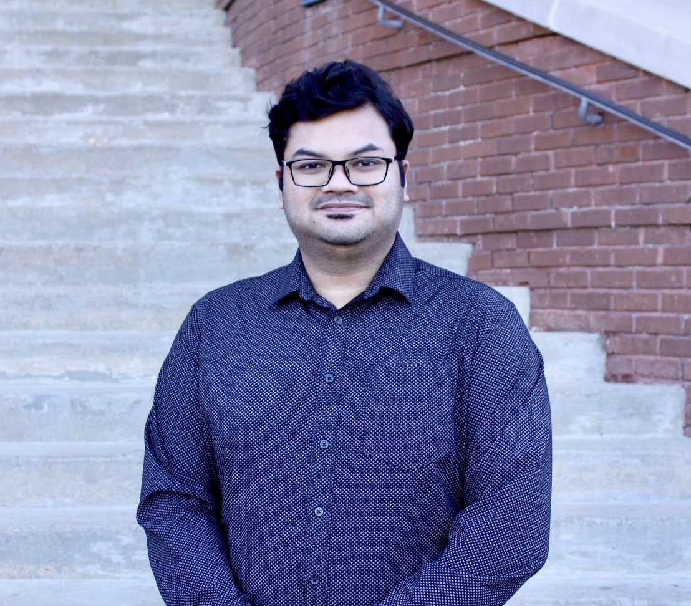

# Ahmed Manavi Alam

## About Me

I am a researcher and engineer specializing in **Digital Signal Processing (DSP)** and **Machine Learning (ML)** for audio, radar, and sensing applications. My expertise includes developing advanced algorithms for immersive audio, room acoustics, radar interference mitigation, and sensor-based activity recognition. I am proficient in Python, MATLAB, and C++, with deep learning experience in TensorFlow and PyTorch.

## Education

- **Ph.D. in Electrical Engineering**, North Carolina State University (Jan 2025 – July 2025)
- **M.S. in Electrical and Computer Engineering**, Mississippi State University (Aug 2021 – Aug 2024)
- **B.S. in Electrical and Electronic Engineering**, Bangladesh University of Engineering and Technology (Feb 2015 – Apr 2019)

## Contact

- 📧 [aalam6@ncsu.edu](mailto:aalam6@ncsu.edu)
- 📧 [manavialam@gmail.com](mailto:manavialam@gmail.com)
- 🔗 [LinkedIn](https://www.linkedin.com/in/ahmed-manavi-alam-833a611b7/)
- 🔗 [GitHub](https://github.com/ahmed-manavi)
- 🔗 [ResearchGate](https://www.researchgate.net/profile/Ahmed-Manavi-Alam)
- 🔗 [Google Scholar](https://scholar.google.com/citations?user=YsHH6asAAAAJ&hl=en)
